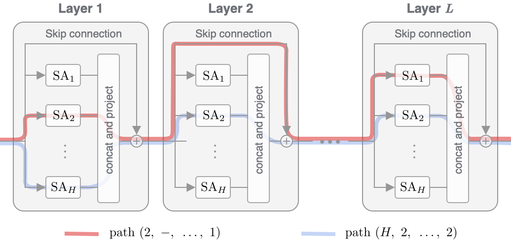

# Attention is not *all* you need, pure attention loses rank doubly exponentially with depth.

[Yihe Dong](https://yihedong.me/), [Jean-Baptiste Cordonnier](http://jbcordonnier.com/), [Andreas Loukas](https://andreasloukas.blog/).

In this work, we find that pure attention decays in rank doubly exponentially with respect to depth. We analyze how MLPs and skip connections counteract this decay. [Our paper contains further details](ARXIV link). This repository contains the code for our experiments.

<p>

</p>

## Requirements

To install a working environment:

```
conda create --name rank-collapse python=3.8
conda activate rank-collapse
pip install git+git://github.com/huggingface/transformers.git@12d7624199e727f37bef7f53d527df7fabdb1fd6
conda install pytorch torchvision torchaudio -c pytorch
conda install -c anaconda scipy scikit-learn black isort matplotlib flake8
```

## Quick start

This repo contains the code to reproduce our experiments. Additional options can be viewed by running `python run_sort --help` or checking out [arguments.py](arguments.py).

### Attention in several architectures
[This notebook](paper-plotting/walking_casual_transformers.ipynb) contains the driver code to study the interplaying effects of pure attention, skip connections, and MLPs in several common attention-based architectures.

### Sorting
This task learns to sort sequences:
```
python run_sort.py --width 2 --depth 6 --hidden_dim 48 --seed 2 --num_labels 10 --seq_len 8 --n_epochs 65 --path_len 0 --n_paths 5 --n_train_data 1000 --n_repeat 5 --n_eval_data 200 --no_sub_path
```

### Convex hull
This task learns to predict the convex hull of a set of points on the plane:
```
python run_convex_hull.py --width 3 --depth 6 --seq_len 10 --hidden_dim 84 --seed 2 --num_labels 2 --n_epochs 70 --path_len 0 --n_paths 5 --n_train_data 10000 --n_repeat 5 --ffn2 --n_eval_data 300 --no_sub_path
```

### Memorization
This task learns to memorize the randomly assigned token labels to natural language:
```
python run_memorization.py --model_name_or_path bert-base-uncased --task_name RTE --do_train --data_dir data/RTE \
    --max_seq_length 128 --per_device_eval_batch_size=32 --per_device_train_batch_size=8 --learning_rate 3e-4 \
    --num_train_epochs 50 --output_dir snap/RTE --overwrite_output_dir --width 2 --depth 6 --hidden_dim 250 \
    --n_repeat 5 --n_paths 5 $1 --n_train_data 500 --no_sub_path --path_len 0
```

### Circle
This experiment recurrently applies a self-attention layer in learning two circular arcs, illustrating rank collapse of the pure attention model, and how skip connections and MLPs counteract it. To run:
```
python run_circle.py --width 2 --depth 1 --num_labels 2 --seq_len 10 --n_epochs 70 --n_train_data 1000 --n_repeat 2  --n_eval_data 300 --hidden_dim 32
```
The above can be modified to add skip connections or MLP to the self-attention network with the `--circle_skip` or `--do_mlp` options, respectively.


### Paths distribution
[This notebook](paper-plotting/paths_counting.ipynb) studies the distribution of paths in some commonly used attention-based models.

## Citation

If you find our work useful, please cite as:

```
@article{rankCollapse2021,
  title         = {Attention is not all you need, pure attention loses rank doubly exponentially with depth},
  author        = {Dong, Yihe and Cordonnier, Jean-Baptiste and Loukas, Andreas},
  url       	= {https://arxiv.org/abs/2101.1  },
  year          = {2021}
  }
```
